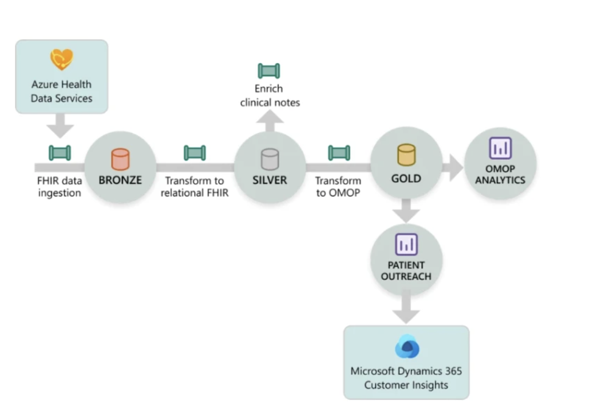
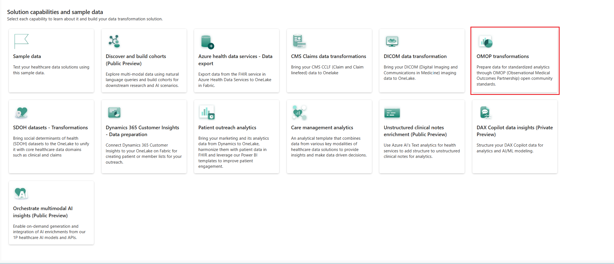
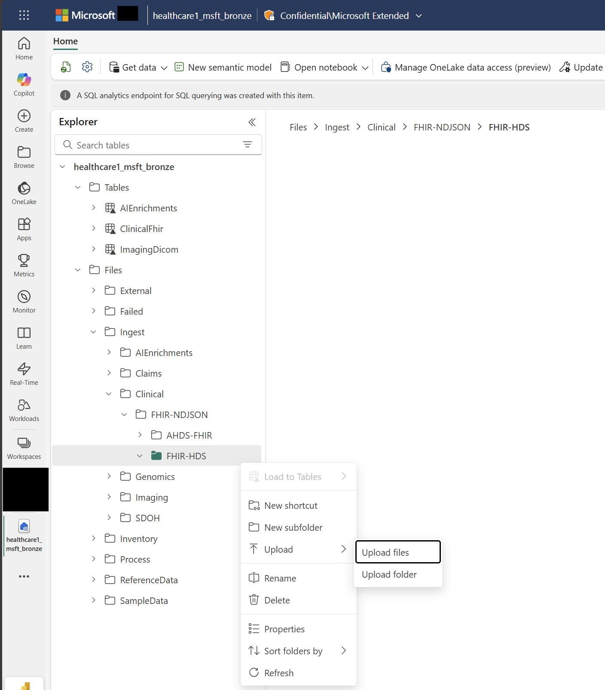

## Microsoft Fabric + healthcare data solutions (HDS) Integration

### Overview
This user guide provides instructions for integrating AI agents with [healthcare data solutions (HDS) on Microsoft Fabric](https://learn.microsoft.com/en-us/industry/healthcare/healthcare-data-solutions/overview). Microsoft Fabric provides a comprehensive ecosystem for data integration, data engineering, real-time analytics, data science, and business intelligence. Healthcare data solutions (HDS) is built on Fabric and provides several capabilities making it easy to manage and analyze your multi-modal healthcare data. 

Healthcare data solutions (HDS) supports both FHIR and OMOP, but will use OMOP in this example. The changes required to use FHIR are trivial and will be covered briefly in this doc. 


### What is healthcare data solutions (HDS) on Fabric?

Healthcare Data Solutions (HDS) in Microsoft Fabric is an end-to-end analytics SaaS platform that enables you to ingest, store, and analyze healthcare data from various sources. HDS provides standardized data models and transformation tools to help create a multi-modal healthcare data warehouse, supporting industry standards like FHIR and DICOM, and ensuring compliance with regulations such as HIPAA and GDPR. HDS also has a growing list AI capabilities to generate and manage AI artifacts, like support for [Dragon Ambient eXperience (DAX) Copilot](https://learn.microsoft.com/en-us/industry/healthcare/dax-copilot-integration/overview?toc=%2Findustry%2Fhealthcare%2Ftoc.json&bc=%2Findustry%2Fbreadcrumb%2Ftoc.json), making it ideal to serve as the data layer for Agentic systems.

Below shows a sample data flow and use cases that HDS unlocks, going from raw FHIR ingestion to dynamic PowerBI reports.


### Prerequisites

The assumption is that you have already deployed Healthcare Agent Orchestrator (HAO) using the default blob storage. Additionally, it is expected you have already onboarded to Fabric and have a baseline understanding of its features and terminiology. More information can be found [here]().

## Deploy healthcare data solutions (HDS) to a Fabric Workspace

In a Fabric workspace, you will want to [deploy the OMOP transformations capability](https://learn.microsoft.com/en-us/industry/healthcare/healthcare-data-solutions/omop-transformations-configure), which emulates a medallion architecture to transform raw NDJSON files into the Observational Medical Outcomes Paternship (OMOP). 



> Note: You do ___NOT___ need to deploy sample data that is shipped with HDS. The next step will show you how to generate and ingest sample data.

## Generate Sample Data

The default storage solution for Healthcare Agent Orchestrator (HAO) uses blob storage. During deployment, the contents of the `infra/data` are uploaded to a storage account. We can re-use the same sample data but it needs to be properly formatted. There is a script `scripts/generate_fhir_resources.py` that needs to be executed to generate FHIR NDJSON files suitable for ingestion by HDS.

Run the script with the following argument to generate the corresponding files:
```
python generate_fhir_resources.py --fabric
```
The newly generated files will be located at `output/fabric`


### Ingesting Sample Data

After generating the sample NDJSON files, you will need to upload them to the Bronze Lakehouse (healthcare1_msft_bronze) that was created during the capability deployment. Open the Lakehouse and expand the 'Files' folder in the left side panel. 



### Run the ingestion pipeline

After uploading the data you want ingested, we need to run the OMOP transformation pipeline. Navigate to the `healthcare1_msft_omop_analytics` data pipeline in your workspace. It should look like the screenshot below. Click on the 'Run' button, the pipeline should take about 10 minutes to complete. You can verify data was processed correctly by checking the notes table in the `healthcare1_msft_gold_omop` lakehouse.


### Create a User Data Function (UDF)

We will create a User Data Function to expose the data in our OMOP Lakehouse. An overview of how to create a UDF can be found [here](https://learn.microsoft.com/en-us/fabric/data-engineering/user-data-functions/user-data-functions-overview). The required code for this sample is located at ```sample/code/path```.

After creating the UDF, make note of the UDF id which will be used in the deployment. This id can be found in the url when opening the UDF. The pattern for the url is as follows:

```
https://powerbi.com/groups/<workspace_id>/userdatafunctions/<udf_id>?experience=power-bi
```

For example, the id in the url below would be `7691d553-f369-4de3-8ce1-58525c795123`
```
https://msit.powerbi.com/groups/73eb06f4-6494-4d6d-ab7e-f92faa5e8643/userdatafunctions/7691d553-f369-4de3-8ce1-58525c795123?experience=power-bi
```

### Onboarding to Fabric REST APIs

The Healthcare Agent Orchestrator (HAO) will interface with Microsoft Fabric by calling some of its [Public REST APIs](https://learn.microsoft.com/en-us/rest/api/fabric/articles/identity-support). In this example we will be using the APIs for Fabric's [User Data Functions](https://blog.fabric.microsoft.com/en-US/blog/service-principal-and-private-library-support-for-fabric-user-data-functions/).

If you are interested in exposing data using a Fabric GraphQL instance, more information can be found [here](https://learn.microsoft.com/en-us/fabric/data-engineering/connect-apps-api-graphql).

We can use Managed Identities that are already created as part of the HAO deployment for authentication when calling [Fabric REST APIs](https://learn.microsoft.com/en-us/rest/api/fabric/articles/using-fabric-apis)


### Assign a Managed Identity to your Workspace

After deploying HAO, your subscription should have multiple managed identities created. You can add the 'Orchestrator' identity to your Fabric Workspace by going to the Workspace landing page and selecting 'Manage Access' to show a side panel. From there, you can click 'Add people or groups' and enter the id or client id of your Orchestrator.


## Update Deployment Parameters

- Update the bicep files with the solution id and UDF artifact id
- Update the bicep files to use client secret credentials

## Redploy the solution

