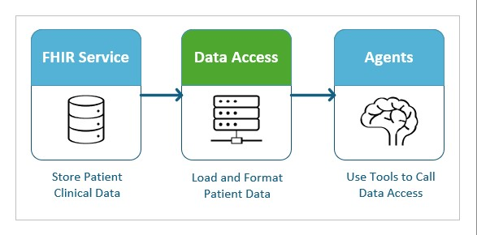

# EHR Integration via HL7® FHIR

This user guide provides instructions for integrating AI agents with an EHR via HL7® FHIR (Fast Healthcare Interoperability Resources) to enable the retrieval of clinical notes. The sample code includes support for a `CLINICAL_NOTES_SOURCE` environment variable, which can be set to activate FHIR service integration. When this integration is enabled, an Azure Healthcare Data Services (AHDS) FHIR service instance will be automatically deployed within your resource group, and sample patient data `patient_4` will be uploaded to the service. With this configuration, the deployed agents will retrieve clinical notes directly from the FHIR service rather than from blob storage, ensuring a more streamlined and standardized access to patient information. The guide also includes practical examples and configurations to help you connect agents to your EHR systems.

## Overview

The dataflow for integrating AI agents with a FHIR service to retrieve clinical notes involves several key components working together. When a clinical note is needed, the agent utilizes tools to make a request for data through the Data Access module. The Data Access module then communicates with the FHIR server, issuing a query for clinical notes associated with a specific patient ID. Upon receiving the request, the FHIR server processes the query and returns the relevant clinical notes to the Data Access module. These notes are then provided back to the agent, enabling it to use the clinical information as needed. This structured dataflow ensures efficient, secure, and standardized retrieval of patient clinical notes into the AI agent’s workflow.

## Authentication

The sample code in this guide demonstrates how to deploy an instance of the AHDS FHIR service and connect to it securely. The FHIR service supports OAuth2 for authentication, ensuring authorized access to healthcare data. The sample code provides three methods for authenticating with the FHIR service:  
   
- **Managed Identity Authentication**: Use Azure managed identities to access the FHIR service without managing credentials.  
- **Client Secret Authentication**: Connect to the FHIR service using a client ID and client secret from a registered Azure Active Directory application.  
- **Custom Authentication**: Implement your own authentication logic, allowing integration with your existing FHIR services or unique authentication requirements.  
   
These examples help users select and configure the appropriate authentication method for connecting agents or applications to their FHIR service instances.

## Data Access

This code sample includes a sample implementation of a FHIR service client named [FhirClinicalNoteAccessor](../src/data_models/fhir/fhir_clinical_note_accessor.py). The [FhirClinicalNoteAccessor](../src/data_models/fhir/fhir_clinical_note_accessor.py) module demonstrates how to connect to a FHIR service and retrieve patient clinical data, specifically clinical notes. Key features of this module include:  
   
- **Authentication Examples:** Step-by-step examples showing how to authenticate requests to the FHIR service using various methods.  
- **Querying Clinical Notes by Patient ID:** Example queries for retrieving clinical notes associated with a specific patient ID from the FHIR service.  
   
This module serves as a practical starting point for developers who want to integrate with their EHR system.
