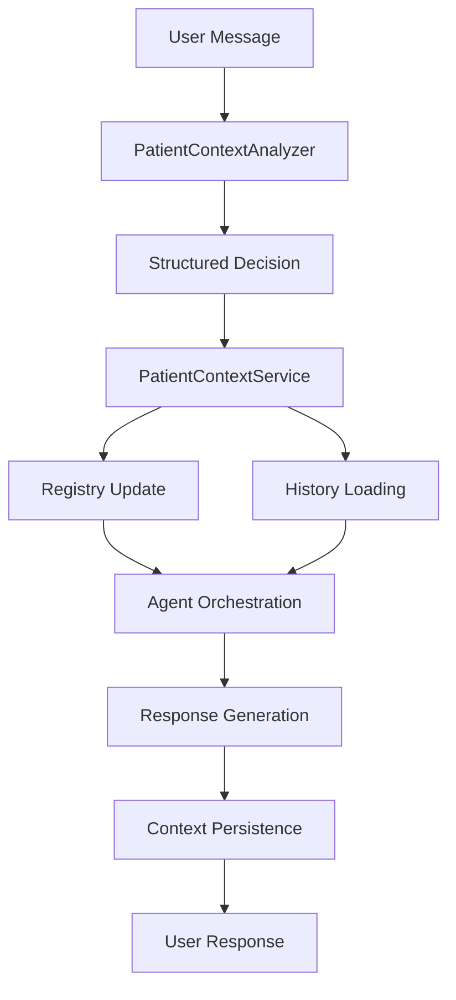

# Healthcare Agent Orchestrator: Patient Context Management System

## Table of Contents
1. [System Overview](#system-overview)
2. [Architecture Principles](#architecture-principles)
3. [Core Data Models](#core-data-models)
4. [Storage Layer](#storage-layer)
5. [Service Layer](#service-layer)
6. [AI Analysis Engine](#ai-analysis-engine)
7. [API Integration](#api-integration)
8. [Agent Integration](#agent-integration)
9. [Data Flow](#data-flow)
10. [File Structure](#file-structure)
11. [Configuration](#configuration)
12. [Troubleshooting](#troubleshooting)

---

## System Overview

The Healthcare Agent Orchestrator implements a sophisticated **patient context management system** that enables patient-specific conversation isolation within a multi-agent AI healthcare platform. This system ensures that conversations about different patients remain completely separate while maintaining the ability to switch between patients seamlessly.

### Key Features
- **Patient-Specific Isolation**: Each patient has their own isolated conversation history
- **Intelligent Context Switching**: AI-powered analysis determines when to switch patients or create new patient contexts
- **Registry-Based Metadata Management**: Centralized patient registry as single source of truth
- **Comprehensive Archival**: Full archival capabilities


---

## Architecture Principles

### 1. Registry as Single Source of Truth
- **Patient Registry**: Centralized JSON file containing all patient metadata
- **No Duplication**: Patient metadata stored only in registry, not in individual chat files
- **Authoritative**: All patient information queries go through registry

### 2. Patient-Isolated Chat History
- **Separate Files**: Each patient has their own chat history file
- **Complete Isolation**: No cross-patient information leakage
- **History Loading**: Only relevant patient history loaded per conversation

### 3. Intelligent Context Switching
- **AI Analysis**: Azure OpenAI analyzes user input to determine context switches
- **Structured Output**: Reliable JSON schema-based decisions
- **Pattern Recognition**: Identifies patient IDs, clear commands, and context switches

### 4. Kernel State Isolation
- **AI State Reset**: Semantic Kernel reset between patients to prevent contamination
- **Clean Context**: Each patient interaction starts with clean AI state
- **Memory Isolation**: No AI memory bleeding between patients

### 5. Comprehensive Audit Trail
- **Timestamped Archives**: Complete archival with timestamps
- **Compliance Ready**: Full audit trail for healthcare compliance
- **Recovery Capability**: Ability to restore any previous state

---

## Core Data Models

### ChatContext (`/src/data_models/chat_context.py`)

The central in-memory container for conversation state.

```python
class ChatContext:
    def __init__(self, conversation_id: str):
        self.conversation_id = conversation_id
        self.chat_history = ChatHistory()          # Semantic Kernel chat history
        
        # Patient context fields
        self.patient_id = None                     # Currently active patient
        self.patient_contexts: Dict[str, PatientContext] = {}  # In-memory patient cache
        self.workflow_summary: Optional[str] = None
        
        # Legacy fields (preserved for compatibility)
        self.patient_data = []
        self.display_blob_urls = []
        self.display_clinical_trials = []
        self.output_data = []
        self.healthcare_agents = {}
```

**Key Responsibilities**:
- Maintains current conversation state
- Tracks active patient (`patient_id`)
- Caches patient metadata from registry (`patient_contexts`)
- Contains conversation history (session or patient-specific)

### PatientContext (`/src/data_models/chat_context.py`)

Minimal per-patient metadata container.

```python
@dataclass
class PatientContext:
    patient_id: str
    facts: Dict[str, Any] = field(default_factory=dict)
```

**Purpose**:
- Stores patient-specific metadata
- Lightweight container for patient facts
- Used both in-memory and persisted to registry

### PatientContextSystemMessage (`/src/data_models/patient_context_models.py`)

Structured system message for agent context.

```python
class PatientContextSystemMessage(KernelBaseModel):
    conversation_id: str
    patient_id: str
    all_patient_ids: List[str]
    timing_sec: TimingInfo
```

**Purpose**:
- Injects patient context into agent conversations
- Provides structured patient information to AI agents
- Includes performance timing data

---

## Storage Layer

### File Structure in Blob Storage

```
{conversation_id}/
├── session_context.json                    # General conversation history
├── patient_{patient_id}_context.json       # Patient-specific conversation history  
├── patient_context_registry.json           # Patient metadata registry (SOURCE OF TRUTH)
└── archive/                                # Timestamped archives
    └── {timestamp}/
        ├── {conversation_id}/
        │   ├── {timestamp}_session_archived.json
        │   └── {timestamp}_patient_{id}_archived.json
        └── {timestamp}_patient_context_registry_archived.json
```

### PatientContextRegistryAccessor (`/src/data_models/patient_context_accessor.py`)

**Single Source of Truth for Patient Metadata**

#### Registry File Format
```json
{
  "conversation_id": "uuid-here",
  "active_patient_id": "patient_15",
  "patient_registry": {
    "patient_4": {
      "patient_id": "patient_4",
      "facts": {},
      "conversation_id": "uuid-here",
      "last_updated": "2025-09-20T18:28:18.995167+00:00"
    },
    "patient_15": {
      "patient_id": "patient_15", 
      "facts": {},
      "conversation_id": "uuid-here",
      "last_updated": "2025-09-20T18:31:26.859910+00:00"
    }
  },
  "last_updated": "2025-09-20T18:31:26.859935"
}
```

#### Key Methods

##### `read_registry(conversation_id) -> (patient_registry, active_patient_id)`
```python
async def read_registry(self, conversation_id: str) -> Tuple[Dict[str, Dict], Optional[str]]:
```
- **Purpose**: Loads patient registry from blob storage
- **Returns**: Tuple of (patient_registry_dict, active_patient_id)
- **Error Handling**: Returns empty registry if file not found

##### `write_registry(conversation_id, patient_registry, active_patient_id)`
```python
async def write_registry(self, conversation_id: str, patient_registry: Dict[str, Dict], active_patient_id: str = None):
```
- **Purpose**: Persists complete patient registry
- **Operation**: Overwrites entire registry file
- **Includes**: Conversation metadata, timestamps, patient data

##### `update_patient_registry(conversation_id, patient_id, registry_entry, active_patient_id)`
```python
async def update_patient_registry(self, conversation_id: str, patient_id: str, registry_entry: Dict, active_patient_id: str = None):
```
- **Purpose**: Updates specific patient entry
- **Flow**: Read → Update → Write
- **Atomic**: Ensures consistency during updates

##### `archive_registry(conversation_id)`
```python
async def archive_registry(self, conversation_id: str) -> None:
```
- **Purpose**: Archives registry before clearing
- **Creates**: Timestamped archive file
- **Cleanup**: Deletes original registry

### ChatContextAccessor (`/src/data_models/chat_context_accessor.py`)

**Manages Chat History Files**

#### File Path Strategy
```python
def get_blob_path(self, conversation_id: str, patient_id: str = None) -> str:
    if patient_id:
        return f"{conversation_id}/patient_{patient_id}_context.json"
    return f"{conversation_id}/session_context.json"
```

#### Key Methods

##### `read(conversation_id, patient_id=None) -> ChatContext`
```python
async def read(self, conversation_id: str, patient_id: str = None) -> ChatContext:
```
- **Purpose**: Loads chat context from appropriate file
- **Logic**: Patient-specific if patient_id provided, session otherwise
- **Registry Independence**: Does NOT restore patient metadata from files

##### `write(chat_ctx: ChatContext)`
```python
async def write(self, chat_ctx: ChatContext) -> None:
```
- **Purpose**: Saves chat context to appropriate file
- **File Selection**: Based on `chat_ctx.patient_id`
- **Content**: Chat history + metadata (NO patient_contexts)

##### `serialize(chat_ctx: ChatContext) -> str`
```python
@staticmethod
def serialize(chat_ctx: ChatContext) -> str:
```
- **Purpose**: Converts ChatContext to JSON
- **Key Change**: **REMOVED patient_contexts serialization**
- **Content**: 
  ```json
  {
    "schema_version": 2,
    "conversation_id": "uuid",
    "patient_id": "patient_15",
    "workflow_summary": null,
    "chat_history": [...],
    "patient_data": [],
    "display_blob_urls": [],
    "output_data": []
  }
  ```

##### `deserialize(data_str: str) -> ChatContext`
```python
@staticmethod
def deserialize(data_str: str) -> ChatContext:
```
- **Purpose**: Loads ChatContext from JSON
- **Legacy Support**: Handles old files with patient_contexts
- **Migration**: Logs legacy format detection

##### `archive_to_folder(conversation_id, patient_id, archive_folder)`
```python
async def archive_to_folder(self, conversation_id: str, patient_id: str, archive_folder: str) -> None:
```
- **Purpose**: Archives context to specific folder
- **Used By**: Clear operations for compliance
- **Structure**: `{archive_folder}/{conversation_id}/{timestamp}_{type}_archived.json`

---

## Service Layer

### PatientContextService (`/src/services/patient_context_service.py`)

**Central Orchestrator for Patient Context Management**

#### Initialization
```python
def __init__(self, analyzer: PatientContextAnalyzer, registry_accessor=None, context_accessor=None):
    self.analyzer = analyzer                    # AI decision engine
    self.registry_accessor = registry_accessor  # Patient metadata storage
    self.context_accessor = context_accessor    # Chat history storage
```

#### Core Methods

##### `_ensure_patient_contexts_from_registry(chat_ctx: ChatContext)`
```python
async def _ensure_patient_contexts_from_registry(self, chat_ctx: ChatContext):
```
**Purpose**: Synchronizes in-memory patient contexts with registry

**Critical Operation**:
1. Reads patient registry from blob storage
2. **Clears all in-memory patient contexts**
3. Rebuilds `patient_contexts` from registry data
4. Ensures registry is authoritative source

**When Called**: Beginning of all major operations

##### `decide_and_apply(user_text: str, chat_ctx: ChatContext) -> (Decision, TimingInfo)`
```python
async def decide_and_apply(self, user_text: str, chat_ctx: ChatContext) -> tuple[Decision, TimingInfo]:
```
**Purpose**: Main entry point for patient context processing

**Complete Flow**:
1. **Registry Sync**: `await self._ensure_patient_contexts_from_registry(chat_ctx)`
2. **Short Message Bypass**: Skip AI analysis for agent handoffs (≤15 chars)
3. **AI Analysis**: Use PatientContextAnalyzer for structured decision
4. **Decision Routing**: Route to appropriate action method
5. **System Message**: Inject patient context for agents
6. **Timing**: Return detailed performance metrics

**Possible Decisions**:
- `NONE`: No patient context needed
- `UNCHANGED`: Continue with current patient  
- `NEW_BLANK`: Created new patient context
- `SWITCH_EXISTING`: Switched to existing patient
- `CLEAR`: Cleared all patient contexts
- `RESTORED_FROM_STORAGE`: Restored from storage
- `NEEDS_PATIENT_ID`: Invalid/missing patient ID

##### `set_explicit_patient_context(patient_id: str, chat_ctx: ChatContext) -> bool`
```python
async def set_explicit_patient_context(self, patient_id: str, chat_ctx: ChatContext) -> bool:
```
**Purpose**: Directly sets specific patient context (bypass AI analysis)

**Flow**:
1. **Registry Sync**: Ensure latest registry data
2. **Validation**: Check patient ID format (`patient_[0-9]+`)
3. **Kernel Reset**: Reset AI kernel when switching patients
4. **Restoration**: Try to restore patient from storage
5. **Creation**: Create new patient if not found
6. **System Message**: Inject patient context
7. **Registry Update**: Persist to registry

##### `_ensure_system_message(chat_ctx: ChatContext, timing: TimingInfo)`
```python
async def _ensure_system_message(self, chat_ctx: ChatContext, timing: TimingInfo):
```
**Purpose**: Injects structured patient context into chat history

**Operation**:
1. **Cleanup**: Remove existing patient context system messages
2. **Registry Query**: Get patient list from registry (authoritative)
3. **Structured Payload**: Create `PatientContextSystemMessage`
4. **Message Injection**: Insert at position 0 in chat history

**System Message Format**:
```
PATIENT_CONTEXT_JSON: {"conversation_id":"uuid","patient_id":"patient_15","all_patient_ids":["patient_4","patient_15"],"timing_sec":{...}}
```

##### `_try_restore_from_storage(chat_ctx: ChatContext) -> bool`
```python
async def _try_restore_from_storage(self, chat_ctx: ChatContext) -> bool:
```
**Purpose**: Fallback restoration from storage files

**Priority Order**:
1. **Patient Registry** (Primary): Authoritative patient metadata
2. **Session Context** (Fallback): Legacy conversation restoration

**Registry Restoration**:
1. Load patient registry
2. Restore ALL patient metadata to memory
3. Set active patient from registry
4. Load patient-specific isolated chat history
5. Replace current history with patient history

##### `_archive_all_and_recreate(chat_ctx: ChatContext)`
```python
async def _archive_all_and_recreate(self, chat_ctx: ChatContext) -> None:
```
**Purpose**: Complete archival and clearing

**Comprehensive Flow**:
1. **Kernel Reset**: Clear AI state
2. **Patient Discovery**: Get ALL patients from registry
3. **Archive Folder**: Create timestamped folder
4. **Session Archive**: Archive main conversation
5. **Patient Archives**: Archive each patient's context
6. **Registry Archive**: Archive patient registry
7. **Memory Clear**: Clear all in-memory state


**Archive Structure**:
```
archive/2025-09-20T18-31-26-123456/
  {conversation_id}/
    20250920T183126_session_archived.json
    20250920T183126_patient_patient_4_archived.json
    20250920T183126_patient_patient_15_archived.json
  20250920T183126_patient_context_registry_archived.json
```

##### `_activate_patient_with_registry(patient_id: str, chat_ctx: ChatContext) -> Decision`
```python
async def _activate_patient_with_registry(self, patient_id: str, chat_ctx: ChatContext) -> Decision:
```
**Purpose**: Activates specific patient with full registry integration

**Decision Logic**:
1. **Validation**: Check patient ID
2. **Same Patient**: Return `UNCHANGED` if already active
3. **Kernel Reset**: Reset AI when switching
4. **Registry Check**: Look for patient in registry
5. **History Loading**: Load patient-specific chat history
6. **Registry Update**: Mark as active patient

**Return Values**:
- `SWITCH_EXISTING`: Patient found in registry/memory
- `NEW_BLANK`: New patient created
- `UNCHANGED`: Same patient already active

##### `_update_registry_storage(chat_ctx: ChatContext)`
```python
async def _update_registry_storage(self, chat_ctx: ChatContext):
```
**Purpose**: Persists current patient state to registry

**Registry Entry**:
```json
{
  "patient_id": "patient_15",
  "facts": {},
  "conversation_id": "uuid"
}
```

**Operation**: Calls registry accessor to update/add patient and set as active

##### `_remove_system_message(chat_ctx: ChatContext)`
```python
def _remove_system_message(self, chat_ctx: ChatContext):
```
**Purpose**: Removes old patient context system messages

**Logic**:
1. Iterate through chat history
2. Identify system messages with `PATIENT_CONTEXT_JSON` prefix
3. Parse JSON to check patient_id
4. Remove messages for current patient
5. Preserve malformed messages (safe default)

##### `_try_restore_specific_patient(patient_id: str, chat_ctx: ChatContext) -> bool`
```python
async def _try_restore_specific_patient(self, patient_id: str, chat_ctx: ChatContext) -> bool:
```
**Purpose**: Restores specific patient metadata

**Priority**:
1. **Registry Storage** (Primary): Authoritative source
2. **Legacy Context File** (Fallback): Migration support

---

## AI Analysis Engine

### PatientContextAnalyzer (`/src/services/patient_context_analyzer.py`)

**Intelligent Decision Engine for Patient Context**

#### Core Capabilities
- **Natural Language Understanding**: Analyzes user input for patient context
- **Structured Output**: Uses Semantic Kernel's JSON schema generation
- **Pattern Recognition**: Identifies patient IDs, clear commands, switches
- **State Isolation**: Kernel reset prevents AI contamination

#### System Prompt Strategy
```python
system_prompt = f"""You are a patient context analyzer for healthcare conversations.

TASK: Analyze user input and decide the appropriate patient context action.

AVAILABLE ACTIONS:
- NONE: No patient context needed (general questions, greetings, system commands)
- CLEAR: User wants to clear/reset all patient context
- ACTIVATE_NEW: User mentions a new patient ID not in the known patient list
- SWITCH_EXISTING: User wants to switch to a different known patient
- UNCHANGED: Continue with current patient context

CURRENT STATE:
- Active patient ID: {prior_patient_id or "None"}
- Known patient IDs: {known_patient_ids}

ANALYSIS RULES:
1. Extract patient_id ONLY if action is ACTIVATE_NEW or SWITCH_EXISTING
2. Patient IDs typically follow "patient_X" format or are explicit medical record numbers
3. For CLEAR/NONE/UNCHANGED actions, set patient_id to null
4. Prioritize explicit patient mentions over implicit context
5. Keep reasoning brief and specific (max 50 words)
"""
```

#### Structured Output Model
```python
class PatientContextDecision(KernelBaseModel):
    action: AnalyzerAction
    patient_id: Optional[str]
    reasoning: str
```

#### Example Decisions

| User Input | Action | Patient ID | Reasoning |
|------------|--------|------------|-----------|
| `"Hello"` | `NONE` | `null` | General greeting, no patient context needed |
| `"clear"` | `CLEAR` | `null` | Explicit clear command detected |
| `"switch to patient_4"` | `SWITCH_EXISTING` or `ACTIVATE_NEW` | `"patient_4"` | Explicit patient switch request |
| `"tumor board for patient_15"` | `ACTIVATE_NEW` or `SWITCH_EXISTING` | `"patient_15"` | Healthcare task with patient mention |
| `"back to you Orchestrator"` | `UNCHANGED` | `null` | Agent handoff, maintain context |

#### Key Methods

##### `analyze_decision(user_text, prior_patient_id, known_patient_ids) -> PatientContextDecision`
```python
async def analyze_decision(
    self,
    user_text: str,
    prior_patient_id: Optional[str] = None,
    known_patient_ids: Optional[list[str]] = None,
) -> PatientContextDecision:
```

**Azure OpenAI Integration**:
```python
execution_settings = AzureChatPromptExecutionSettings(
    service_id="patient_context_analyzer",
    max_tokens=200,
    temperature=0.1,
    response_format=PatientContextDecision,  # Automatic JSON schema
)
```

##### `reset_kernel()`
```python
def reset_kernel(self):
```
**Purpose**: Prevents AI state contamination between patients
- Recreates entire Kernel instance
- Reinitializes AzureChatCompletion service
- Ensures clean AI state for each patient

---

## API Integration

### WebSocket Chat Route (`/src/routes/api/chats.py`)

**Main User Interface for Patient Context System**

#### Complete Flow Analysis

##### `websocket_chat_endpoint(websocket: WebSocket, chat_id: str)`

**Step-by-Step Patient Context Integration**:

1. **Session Context Loading**:
```python
chat_context = await data_access.chat_context_accessor.read(chat_id, None)
```
- Always starts with session context
- Establishes base conversation state

2. **Clear Command Processing**:
```python
if await _handle_clear_command(content, chat_context):
```
- **Priority**: Processed BEFORE patient context analysis
- **Comprehensive**: Archives all contexts and registry
- **Response**: Immediate clear confirmation

3. **Patient Context Decision**:
```python
decision, timing = await patient_context_service.decide_and_apply(content, chat_context)
```
- **AI-Powered**: Uses PatientContextAnalyzer
- **Registry Integration**: Syncs with patient registry
- **Performance**: Captures timing metrics

4. **Error Handling**:
```python
if decision == "NEEDS_PATIENT_ID":
    # Send helpful error message
```
- **User Guidance**: Explains patient ID format
- **Format Example**: `'patient_X' (e.g., 'patient_4')`

5. **Patient History Isolation**:
```python
if chat_context.patient_id:
    isolated_ctx = await data_access.chat_context_accessor.read(chat_id, chat_context.patient_id)
    chat_context.chat_history = isolated_ctx.chat_history
```
- **Critical Isolation**: Loads ONLY active patient's history
- **Complete Replacement**: Overwrites session history
- **Fresh Start**: Empty history for new patients

6. **Agent Orchestration**:
```python
chat, chat_context = group_chat.create_group_chat(app_context, chat_context)
```
- **Multi-Agent**: Creates healthcare agent conversation
- **Context Injection**: System message contains patient context

7. **Response Enhancement**:
```python
response_content_with_pc = _append_pc_ctx_display(response.content, chat_context)
```
- **UI Enhancement**: Adds patient context display
- **User Visibility**: Shows active patient and session patients

8. **Context Persistence**:
```python
await data_access.chat_context_accessor.write(chat_context)
```
- **Automatic**: Saves to appropriate file (patient/session)
- **Registry Sync**: Patient metadata already updated

#### Clear Command Handler

##### `_handle_clear_command(content: str, chat_context) -> bool`

**Comprehensive Clear Operation**:

1. **Command Recognition**: 
   - `"clear"`
   - `"clear patient"`
   - `"clear context"`
   - `"clear patient context"`

2. **Archival Process**:
```python
# Create timestamped archive folder
timestamp = datetime.now(timezone.utc).strftime("%Y-%m-%dT%H-%M-%S-%f")
archive_folder = f"archive/{timestamp}"

# Archive session context
await data_access.chat_context_accessor.archive_to_folder(...)

# Archive ALL patient contexts from registry
patient_registry, _ = await patient_context_service.registry_accessor.read_registry(...)
for patient_id in patient_registry.keys():
    await data_access.chat_context_accessor.archive_to_folder(...)

# Archive patient registry
await patient_context_service.registry_accessor.archive_registry(...)
```

3. **Memory Clear**:
```python
chat_context.patient_context = None
chat_context.patient_contexts.clear()
chat_context.chat_history.messages.clear()
chat_context.patient_id = None
```


#### Patient Context Display

##### `_append_pc_ctx_display(base: str, chat_context) -> str`

**UI Enhancement for Patient Visibility**:

1. **System Message Extraction**: Gets patient context JSON
2. **JSON Parsing**: Parses structured payload
3. **Markdown Formatting**: Creates user-friendly display

**Display Format**:
```markdown
---
*PT_CTX:*
- **Patient ID:** `patient_15`
- **Conversation ID:** `uuid`
- **Session Patients:** `patient_4`, `patient_15 (active)`
```

---

## Agent Integration

### How Healthcare Agents See Patient Context

#### System Message Injection
Every agent conversation includes structured patient context:

```json
{
  "role": "system",
  "content": "PATIENT_CONTEXT_JSON: {\"conversation_id\":\"uuid\",\"patient_id\":\"patient_15\",\"all_patient_ids\":[\"patient_4\",\"patient_15\"],\"timing_sec\":{...}}"
}
```

#### Agent Awareness
- **Active Patient**: Agents know current patient
- **Session Patients**: Agents see all patients in session  
- **Conversation Scope**: Agents understand context boundaries
- **Performance Data**: Timing metrics available

#### Isolation Benefits
- **Clean History**: Only relevant patient conversation
- **Context Switching**: Clear boundaries between patients
- **Privacy Protection**: No cross-patient information leakage
- **Compliance**: Full audit trail per patient

#### Group Chat Integration (`/src/group_chat.py`)

**Patient Context in Multi-Agent Conversations**:

1. **Context Injection**: 
```python
inject_workflow_summary(chat_ctx)
```

2. **Agent Creation**: Each agent gets fresh kernel with patient context

3. **Selection Strategy**: AI-powered agent selection with patient awareness

4. **Termination Strategy**: Context-aware conversation termination

---

## Data Flow

### Complete Patient Context Lifecycle



### Detailed Flow Steps

1. **User Input**: Message received via WebSocket
2. **AI Analysis**: PatientContextAnalyzer determines action
3. **Service Processing**: PatientContextService executes decision
4. **Registry Sync**: Patient metadata updated in registry
5. **History Loading**: Appropriate chat history loaded
6. **Agent Orchestration**: Multi-agent conversation with context
7. **Response Generation**: AI agents generate responses
8. **Context Persistence**: State saved to appropriate files
9. **User Display**: Enhanced response with patient context

### Storage Operations

#### Read Operations
```python
# Registry (authoritative)
patient_registry, active_id = await registry_accessor.read_registry(conversation_id)

# Chat History (patient-specific or session)
chat_ctx = await context_accessor.read(conversation_id, patient_id)
```

#### Write Operations
```python
# Registry Update
await registry_accessor.update_patient_registry(conversation_id, patient_id, entry, active_id)

# Chat History Save
await context_accessor.write(chat_ctx)
```

#### Archive Operations
```python
# Complete Archival
await context_accessor.archive_to_folder(conversation_id, patient_id, archive_folder)
await registry_accessor.archive_registry(conversation_id)
```

---

## File Structure

### Project Organization

```
src/
├── services/
│   ├── patient_context_service.py      # Main orchestrator
│   └── patient_context_analyzer.py     # AI decision engine
├── data_models/
│   ├── chat_context.py                 # Core data models
│   ├── chat_context_accessor.py        # Chat history storage
│   ├── patient_context_accessor.py     # Registry storage
│   └── patient_context_models.py       # Structured output models
├── routes/api/
│   └── chats.py                        # WebSocket API integration
└── group_chat.py                       # Multi-agent orchestration
```

### Configuration Files

#### Environment Variables
```env
AZURE_OPENAI_DEPLOYMENT_NAME=gpt-4o
AZURE_OPENAI_API_VERSION=2025-04-01-preview
PATIENT_CONTEXT_DECIDER_DEPLOYMENT_NAME=gpt-4o  # Optional override
```

#### Agent Configuration
```json
{
  "agents": [
    {
      "name": "Orchestrator",
      "facilitator": true,
      "instructions": "You are the healthcare orchestrator...",
      "tools": [...]
    }
  ]
}
```

---

## Configuration

### Service Initialization

```python
# In routes/api/chats.py
analyzer = PatientContextAnalyzer(token_provider=app_context.cognitive_services_token_provider)
patient_context_service = PatientContextService(
    analyzer=analyzer,
    registry_accessor=app_context.data_access.patient_context_registry_accessor,
    context_accessor=app_context.data_access.chat_context_accessor
)
```

### Azure OpenAI Setup

```python
# In PatientContextAnalyzer
self._kernel.add_service(
    AzureChatCompletion(
        service_id="patient_context_analyzer",
        deployment_name=self.deployment_name,
        api_version=self.api_version,
        ad_token_provider=token_provider,
    )
)
```

### Storage Configuration

```python
# In DataAccess
patient_context_registry_accessor = PatientContextRegistryAccessor(
    blob_service_client=blob_service_client,
    container_name="chat-sessions"
)

chat_context_accessor = ChatContextAccessor(
    blob_service_client=blob_service_client,
    container_name="chat-sessions",
    cognitive_services_token_provider=token_provider
)
```

---

## Conclusion

The Healthcare Agent Orchestrator's patient context management system provides a robust, compliant, and scalable solution for managing patient-specific AI conversations. By implementing registry-based metadata management, intelligent context switching, and comprehensive archival capabilities, the system ensures both user experience and regulatory compliance in healthcare AI applications.

The architecture's separation of concerns, structured decision making, and comprehensive error handling make it suitable for production healthcare environments while maintaining the flexibility needed for complex multi-agent AI interactions.